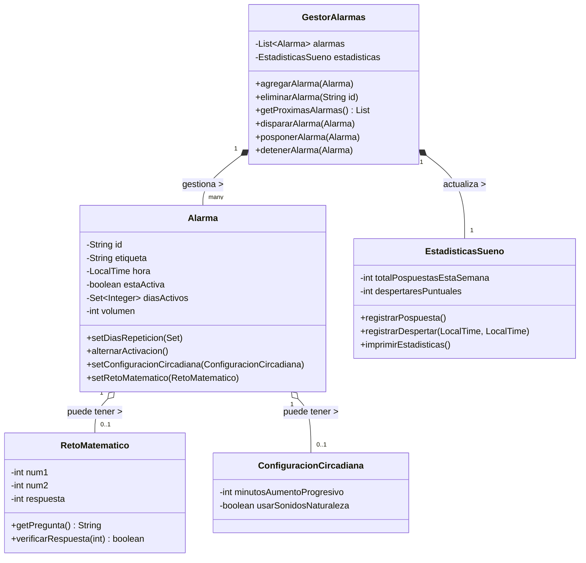
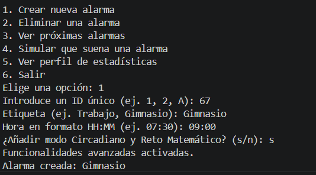
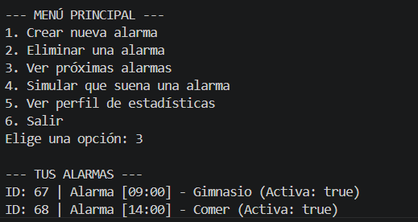
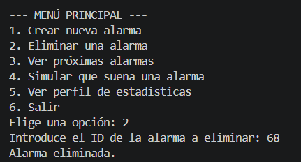
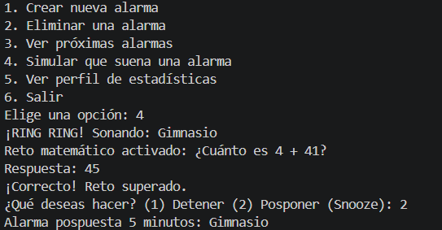
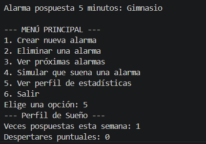
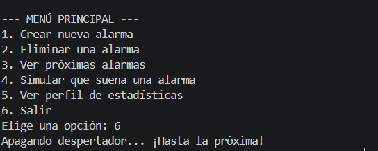

# ⏰ Smart Alarm - Lógica de Despertador Inteligente

## 1. Descripción del Proyecto
Este proyecto implementa la lógica de backend en Java para un despertador inteligente inspirado en smartphones modernos. La aplicación se ejecuta sin interfaz gráfica mediante una consola interactiva, procesando la gestión de alarmas mediante un modelo puramente Orientado a Objetos.

## 2. Objetivos
- Resolver el problema de la gestión del tiempo y la creación de hábitos de sueño saludables.
- Evitar que los usuarios se queden dormidos utilizando métodos intrusivos o graduales (Retos matemáticos, Despertar circadiano).
- Analizar los hábitos del usuario a través de un perfil de estadísticas de sueño.

## 3. Tecnologías Utilizadas
- **Lenguaje:** Java (JDK 17+)
- **Herramientas de control de versiones:** Git y GitHub
- **Diagramado UML:** Mermaid
- **Editor:** Visual Studio Code

## 4. Instalación y Ejecución
1. Clonar el repositorio: `git clone <URL_DEL_REPO>`
2. Navegar a la carpeta fuente: `cd trabajofinalentornos/src`
3. Compilar los archivos Java: `javac *.java`
4. Ejecutar el simulador interactivo: `java Main`

## 5. Estructura del Proyecto
/trabajofinalentornos
  ├── /src
  ├── /docs
  └── README.md

## 6. Diseño Orientado a Objetos
El diseño consta de las siguientes clases principales:
- **`Alarma`**: Actúa como el modelo de datos principal. Encapsula información como la hora, etiqueta, días de repetición y configuraciones avanzadas.
- **`GestorAlarmas`**: Es el controlador central. Gestiona la lista de alarmas (crear, borrar, listar) e interactúa con otras clases para disparar o posponer alarmas.
- **`EstadisticasSueno`**: Acumula datos históricos del usuario basándose en los eventos (snooze/stop) que le envía el `GestorAlarmas`.
- **`RetoMatematico` y `ConfiguracionCircadiana`**: Clases auxiliares inyectadas por composición dentro de `Alarma`, respetando el principio de Responsabilidad Única (SRP).

## 7. Diagrama de Clases UML (Mermaid)


*Justificación:* Se ha utilizado composición (`*--`) para la relación entre el Gestor y las alarmas, ya que el gestor controla su ciclo de vida lógico en memoria. Se ha utilizado agregación (`o--`) para las configuraciones avanzadas dentro de la alarma, ya que son opcionales.

## 8. Diagrama de Casos de Uso (Mermaid)

```mermaid
graph LR
    User((Usuario))
    
    User --> (Crear Alarma)
    User --> (Configurar Reto Matemático)
    User --> (Posponer Alarma)
    User --> (Detener Alarma)
    User --> (Consultar Estadísticas)

    (Detener Alarma) -.-> |<<extend>>| (Resolver Reto Matemático)
```

## 9. Especificación de Casos de Uso

**Caso de Uso 1: Crear Alarma**
- **Nombre:** Crear Alarma Interactiva
- **Objetivo:** Registrar una nueva alarma en el sistema.
- **Actor principal:** Usuario.
- **Precondiciones:** El sistema debe estar inicializado y mostrando el menú principal.
- **Flujo principal:**
  1. El usuario selecciona la opción de crear y escribe la hora, minutos y una etiqueta.
  2. El sistema valida el formato de la hora introducida.
  3. El sistema crea el objeto `Alarma` y lo guarda en `GestorAlarmas`.
- **Flujos alternativos:** Si la hora es inválida o se introduce texto en lugar de números, el sistema avisa del error y rechaza la creación.
- **Postcondiciones:** La alarma queda registrada y programada en la lista.
- **Reglas de negocio:** El usuario puede decidir en el momento de la creación si añade los retos matemáticos o la configuración circadiana.

**Caso de Uso 2: Detener Alarma con Reto**
- **Nombre:** Detener Alarma con Reto
- **Objetivo:** Apagar la alarma resolviendo un problema matemático.
- **Actor principal:** Usuario.
- **Precondiciones:** La alarma debe estar sonando y tener el reto configurado.
- **Flujo principal:**
  1. El sistema muestra la operación matemática por consola.
  2. El usuario introduce el resultado por teclado.
  3. El sistema valida la respuesta en `RetoMatematico` y detiene la alarma, enviando la hora a `EstadisticasSueno`.
- **Flujos alternativos:** Si falla o introduce letras, la alarma captura el error, sigue sonando y vuelve a preguntar.
- **Postcondiciones:** La alarma se apaga y se registra la estadística.
- **Reglas de negocio:** No se puede detener la alarma de ninguna otra forma si el reto está activo sin resolverlo correctamente.

## 10. Reflexión Técnica
Durante el diseño, uno de los retos principales fue cómo desacoplar la lógica de sonido/brillo (Circadiana) del modelo base de la alarma. Se optó por usar el patrón de agregación, delegando la configuración a objetos específicos (`ConfiguracionCircadiana`). Para el manejo de fechas se utilizó el API moderna de Java (`java.time.LocalTime`), lo que evita problemas de deuda técnica frente a la obsoleta clase `Date`. Se han aplicado principios SOLID, separando la lógica estadística (`EstadisticasSueno`) del gestor principal. Además, se implementó un control de flujo mediante `Scanner` en el `Main` para capturar errores del usuario (programación defensiva).

## 11. Reflexión sobre IA
- **Herramientas usadas:** Gemini.
- **Prompts utilizados:** *"Actúa como un experto en Java y diséñame las clases para la lógica de un despertador..."*, *"Genera un diagrama de clases Mermaid basado en este código"*, *"Modifica el Main para usar la consola y Scanner"*.
- **Ayuda:** La IA fue fundamental para estructurar el proyecto rápidamente y generar el esqueleto de las clases y la sintaxis de los diagramas Mermaid, lo cual suele ser propenso a errores tipográficos.
- **Fallos y Limitaciones:** Inicialmente, la IA intentaba incluir dependencias gráficas o proponía una ejecución totalmente estática. Tuve que corregirlo pidiendo que usara `Scanner` para crear un menú interactivo real que capturara fallos del usuario.
- **Validación:** Validé el código ejecutando el archivo `Main.java` interactivamente, forzando fallos por teclado y comprobando que las salidas por consola y los cálculos estadísticos funcionaban correctamente sin colgarse.

## 12. Capturas de Ejecución
Aquí se demuestra el funcionamiento interactivo por consola, la captura de errores y el registro de estadísticas:






