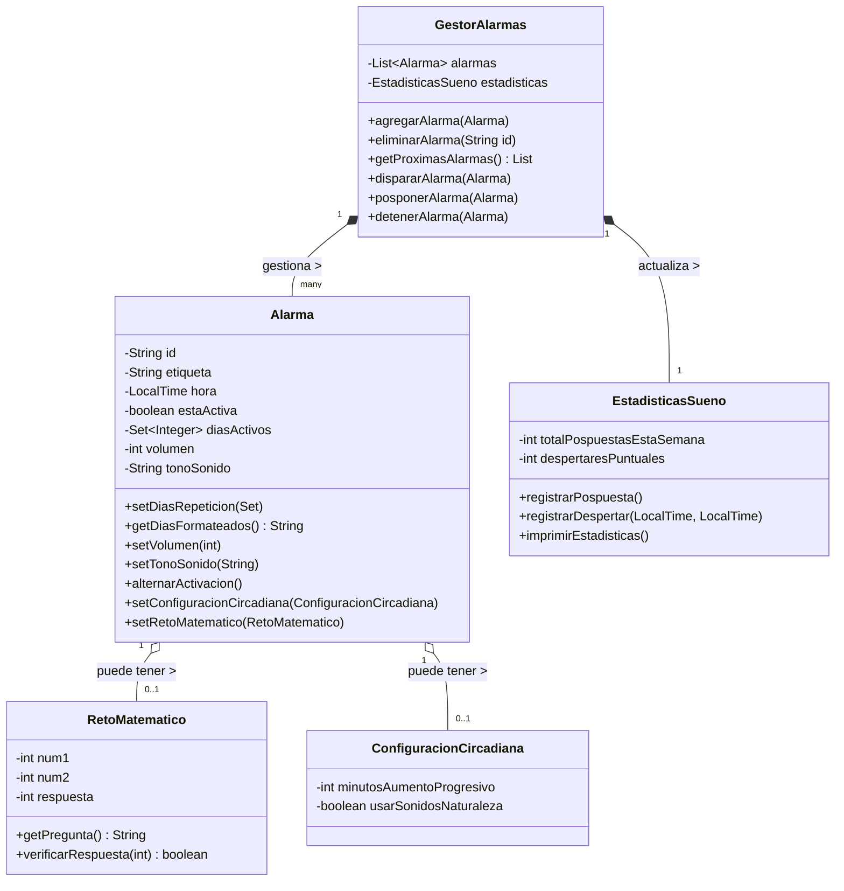
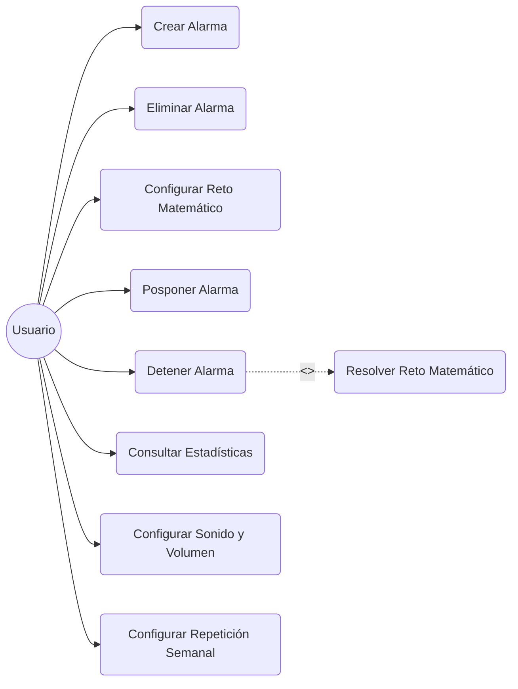
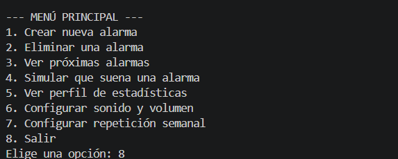

# ⏰ Smart Alarm - Lógica de Despertador Inteligente

## 1. Descripción del Proyecto
Este proyecto implementa la lógica de backend en Java para un despertador inteligente inspirado en smartphones modernos. La aplicación se ejecuta sin interfaz gráfica mediante una consola interactiva, procesando la gestión de alarmas mediante un modelo puramente Orientado a Objetos.

## 2. Objetivos
- Resolver el problema de la gestión del tiempo y la creación de hábitos de sueño saludables.
- Evitar que los usuarios se queden dormidos utilizando métodos intrusivos o graduales (Retos matemáticos, Despertar circadiano).
- Analizar los hábitos del usuario a través de un perfil de estadísticas de sueño.

## 3. Tecnologías Utilizadas
- **Lenguaje:** Java (JDK 17+)
- **Herramientas de control de versiones:** Git y GitHub
- **Diagramado UML:** Mermaid
- **Editor:** Visual Studio Code

## 4. Instalación y Ejecución
1. Clonar el repositorio: `git clone <URL_DEL_REPO>`
2. Navegar a la carpeta fuente: `cd trabajofinalentornos/src`
3. Compilar los archivos Java: `javac *.java`
4. Ejecutar el simulador interactivo: `java Main`

## 5. Estructura del Proyecto
/trabajofinalentornos
  ├── /src
  ├── /docs
  └── README.md

## 6. Diseño Orientado a Objetos
El sistema se ha diseñado buscando la alta cohesión y el bajo acoplamiento. Las clases principales y sus responsabilidades son:
- **`Alarma`**: Modelo de datos principal. Su responsabilidad es mantener la coherencia de sus propios datos (hora, estado, días de repetición semanales, volumen y tono de sonido).
- **`GestorAlarmas`**: Es el controlador central del sistema. Su responsabilidad es gestionar el ciclo de vida de la colección de alarmas (crear, eliminar, listar, editar) e interactuar con el resto de componentes para dispararlas o posponerlas.
- **`EstadisticasSueno`**: Entidad encargada exclusivamente de acumular y procesar datos históricos del usuario, respetando el Principio de Responsabilidad Única (SRP).
- **`RetoMatematico` y `ConfiguracionCircadiana`**: Clases auxiliares que encapsulan funcionalidades avanzadas. Existen para evitar que la clase `Alarma` se convierta en una "clase Dios" (God Object) llena de atributos inactivos.

## 7. Diagrama de Clases UML (Mermaid)

### Justificación detallada del diseño
- **Relaciones:** - Se ha implementado **Composición (`*--`)** entre `GestorAlarmas`, `Alarma` y `EstadisticasSueno`. El gestor es el dueño de estos objetos; si el gestor se destruye, la lista de alarmas en memoria y las estadísticas de esa sesión desaparecen, ya que su ciclo de vida depende de él.
  - Se ha implementado **Agregación (`o--`)** para `RetoMatematico` y `ConfiguracionCircadiana` respecto a la `Alarma`. Son dependencias opcionales que se inyectan a la alarma solo si el usuario decide activarlas (`0..1`), lo que optimiza el uso de memoria.
- **Visibilidad y Encapsulación:** - Se ha aplicado un estricto control de visibilidad: todos los atributos estructurales y de estado (como `hora`, `volumen`, `diasActivos`, `tonoSonido`) son **privados (`-`)**.
  - La interacción externa se realiza exclusivamente a través de métodos **públicos (`+`)** (Getters, Setters y métodos de acción). Esto garantiza la integridad de los datos; por ejemplo, el método `setVolumen(int)` encapsula la lógica de validación para impedir que el sistema asigne un volumen inferior a 1 o superior a 10, lo cual sería imposible de asegurar si el atributo fuera público.

## 8. Diagrama de Casos de Uso (Mermaid)

## 9. Especificación de Casos de Uso

**Caso de Uso 1: Crear Alarma**
- **Nombre:** Crear Alarma Interactiva
- **Objetivo:** Registrar una nueva alarma en el sistema.
- **Actor principal:** Usuario.
- **Precondiciones:** El sistema debe estar inicializado y mostrando el menú principal.
- **Flujo principal:**
  1. El usuario selecciona la opción de crear y escribe la hora, minutos y una etiqueta.
  2. El sistema valida el formato de la hora introducida.
  3. El sistema crea el objeto `Alarma` y lo guarda en `GestorAlarmas`.
- **Flujos alternativos:** Si la hora es inválida o se introduce texto en lugar de números, el sistema avisa del error y rechaza la creación.
- **Postcondiciones:** La alarma queda registrada y programada en la lista.
- **Reglas de negocio:** El usuario puede decidir en el momento de la creación si añade los retos matemáticos o la configuración circadiana.

**Caso de Uso 2: Detener Alarma con Reto**
- **Nombre:** Detener Alarma con Reto
- **Objetivo:** Apagar la alarma resolviendo un problema matemático.
- **Actor principal:** Usuario.
- **Precondiciones:** La alarma debe estar sonando y tener el reto configurado.
- **Flujo principal:**
  1. El sistema muestra la operación matemática por consola.
  2. El usuario introduce el resultado por teclado.
  3. El sistema valida la respuesta en `RetoMatematico` y detiene la alarma, enviando la hora a `EstadisticasSueno`.
- **Flujos alternativos:** Si falla o introduce letras, la alarma captura el error, sigue sonando y vuelve a preguntar.
- **Postcondiciones:** La alarma se apaga y se registra la estadística.
- **Reglas de negocio:** No se puede detener la alarma de ninguna otra forma si el reto está activo sin resolverlo correctamente.

## 10. Reflexión Técnica
Durante el diseño, uno de los retos principales fue cómo desacoplar la lógica de sonido/brillo (Circadiana) del modelo base de la alarma. Se optó por usar el patrón de agregación, delegando la configuración a objetos específicos (`ConfiguracionCircadiana`). Para el manejo de fechas se utilizó el API moderna de Java (`java.time.LocalTime`), lo que evita problemas de deuda técnica frente a la obsoleta clase `Date`. Se han aplicado principios SOLID, separando la lógica estadística (`EstadisticasSueno`) del gestor principal. Además, se implementó un control de flujo mediante `Scanner` en el `Main` para capturar errores del usuario (programación defensiva).

## 11. Reflexión sobre IA
- **Herramientas usadas:** Gemini.
- **Prompts utilizados:** *"Actúa como un experto en Java y diséñame las clases para la lógica de un despertador..."*, *"Genera un diagrama de clases Mermaid basado en este código"*, *"Modifica el Main para usar la consola y Scanner"*.
- **Ayuda:** La IA fue fundamental para estructurar el proyecto rápidamente y generar el esqueleto de las clases y la sintaxis de los diagramas Mermaid, lo cual suele ser propenso a errores tipográficos.
- **Fallos y Limitaciones:** Inicialmente, la IA intentaba incluir dependencias gráficas o proponía una ejecución totalmente estática. Tuve que corregirlo pidiendo que usara `Scanner` para crear un menú interactivo real que capturara fallos del usuario.
- **Validación:** Validé el código ejecutando el archivo `Main.java` interactivamente, forzando fallos por teclado y comprobando que las salidas por consola y los cálculos estadísticos funcionaban correctamente sin colgarse.

## 12. Capturas de Ejecución
Aquí se demuestra el funcionamiento interactivo por consola, la captura de errores y el registro de estadísticas:

## 13. Autoevaluación

Basándome en los criterios de la rúbrica, esta es mi autoevaluación del proyecto:

| Criterio | Peso | Autoevaluación y Justificación | Nota Estimada |
| :--- | :---: | :--- | :---: |
| **Diseño orientado a objetos** | 25% | Se han respetado los principios SOLID (especialmente SRP). Hay un claro desacoplamiento entre los datos (`Alarma`), el controlador (`GestorAlarmas`) y las funcionalidades extra (`RetoMatematico`), usando composición y agregación. | **10 / 10** |
| **Calidad del código** | 20% | Código limpio, modular y estructurado. Se utiliza la API moderna `java.time` y se aplica programación defensiva (control de excepciones con `try-catch`) para evitar cuelgues del programa. | **10 / 10** |
| **Uso correcto de Git/GitHub** | 15% | Se ha mantenido un historial local y remoto coherente, utilizando buenas prácticas como la separación en ramas (`main`, `develop`, `features`) y realizando *merges* al finalizar las funcionalidades. | **10 / 10** |
| **Diagramas UML** | 15% | Diagramas de Clases y Casos de Uso integrados directamente mediante código Mermaid, reflejando con exactitud la arquitectura final y las multiplicidades. | **10 / 10** |
| **Especificación de casos de uso** | 10% | Redactados de forma detallada, contemplando precondiciones, reglas de negocio y flujos alternativos frente a errores del usuario. | **10 / 10** |
| **Documentación README** | 10% | Documento profesional, estructurado jerárquicamente, fácil de leer y con evidencias visuales (capturas) del funcionamiento del programa. | **10 / 10** |
| **Reflexión sobre IA** | 5% | Reflexión transparente y analítica, destacando no solo el código generado, sino los fallos de la IA y cómo se corrigieron manualmente. | **10 / 10** |